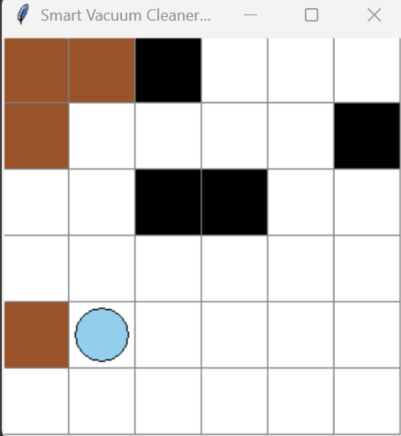
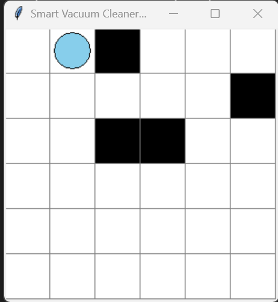

# Smart Vacuum Cleaner Agent 🚀

An intelligent agent that navigates a 2D grid using A* pathfinding to clean dirty tiles. Built in Python with a Tkinter GUI.

---

## 🧠 Features
- Grid-based room layout with clean, dirty, and wall tiles
- Smart vacuum agent with A* pathfinding logic
- Real-time visualization with Tkinter
- Simulates cleaning process in a dynamic environment

---

## 🗂️ Project Structure
- `main.py` – Main app logic and GUI rendering
- `agent.py` – Agent class with A* pathfinding and actions
- `room.py` – Grid environment with random dirt and wall generation

---

## ▶️ How to Run
1. Install Python 3.8+
2. Clone the repository:
   ```bash
   git clone https://github.com/your-username/smart-vacuum-agent.git
   cd smart-vacuum-agent
   ```
3. Run the program:
   ```bash
   python main.py
   ```

---

## 🖼️ Screenshots


<br>*Initial environment with dirt and walls*


<br>*Agent cleaned all tiles using A* pathfinding*

---

## 🚀 Future Plans
- Add multiple agents (multi-agent coordination)
- Introduce battery life and recharging stations
- Allow user to draw walls and dirt manually

---

## 📌 Technologies Used
- Python
- Tkinter (for GUI)
- A* Algorithm (for pathfinding)

---

## 🌐 License
MIT License

---

Feel free to fork, star, or suggest improvements!

> Designed with ❤️ for AI and automation enthusiasts.
